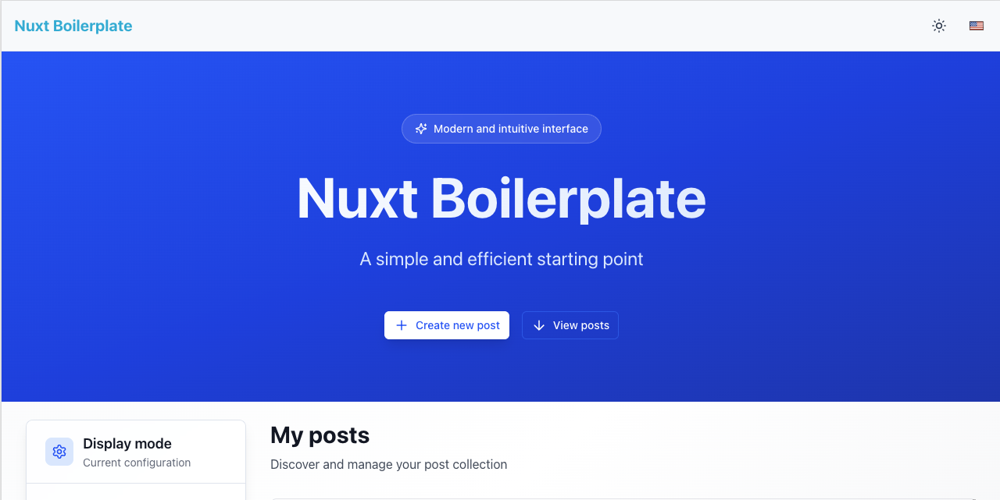

# Nuxt Boilerplate

A modern **Nuxt 4** production-ready boilerplate with TypeScript, Nuxt UI, Prisma, and PostgreSQL.



## 🚀 Features

- **🔧 Nuxt 4** with Vue 3 Composition API and TypeScript
- **🎨 Nuxt UI** components with Tailwind CSS
- **🗄️ Prisma ORM** with PostgreSQL and Docker setup
- **🌍 Internationalization** (French/English/German/Србски) with auto-detection
- **📚 API Documentation** with OpenAPI/Swagger (dev-only)
- **🛡️ Security** hardening with CORS, CSP, and rate limiting
- **🧪 Testing** with Vitest (unit) and Playwright (E2E)
- **✨ Code Quality** with ESLint, Prettier, and Husky hooks
- **🐳 Docker** support for easy deployment

## ⚡ Quick Start

### Prerequisites

- Node.js ≥ 22.0.0
- npm ≥ 10.0.0
- Docker (for PostgreSQL)

### Setup

1. **Clone and install**

   ```bash
   git clone <repository-url> my-project
   cd my-project
   ./rename-project.sh my-awesome-project  # Optional: Rename project
   npm install
   cp .env.example .env
   ```

2. **Start database**

```bash
docker compose up -d          # Start PostgreSQL
npx prisma migrate dev        # Run database migrations

// Example for Prisma generation:
// prisma generate --schema=prisma/schema-postgres.prisma
// prisma generate --schema=prisma/schema-mysql.prisma
// prisma generate --schema=prisma/schema-mongo.prisma
// Prisma Client for MongoDB, MySQL, and PostgreSQL
// is automatically generated if the corresponding schemas exist.
// Database connection environment variables should be defined in the .env file.
npx prisma db push            # Push schema changes (development)
npx prisma studio             # Open Prisma Studio (http://localhost:5555)
npx prisma generate           # Generate Prisma Client
npx prisma migrate reset       # Reset database (use with caution)
npx prisma migrate deploy      # Deploy migrations to production
npx prisma db seed            # Seed database with initial data (if applicable)
npx prisma introspect         # Introspect existing database schema
npx prisma format             # Format Prisma schema
npx prisma validate           # Validate Prisma schema
npx prisma version            # Check Prisma version
```

> Note: Ensure PostgreSQL is running on `localhost:5432` or update `.env` accordingly. 3. **Run development server**

```bash
npm run dev
```

### 🌐 Access Points

- **Application**: http://localhost:3000
- **API Documentation**: http://localhost:3000/api/docs/ui
- **Database Admin**: http://localhost:5555 (Prisma Studio)

The app includes a simple **Posts** example to demonstrate the full stack.

## 🛠️ Development Commands

### Development

```bash
npm run dev                   # Start development server
npm run build                 # Build for production
npm run preview               # Preview production build
npm run lint                  # Run ESLint + Prettier
```

### Testing

```bash
npm run test                  # Run all tests (unit + E2E)
npm run test:unit             # Run unit tests only
npm run test:e2e              # Run E2E tests only
npm run test:unit:coverage    # Run tests with coverage
```

### Database

```bash
docker compose up -d          # Start PostgreSQL + Adminer
npx prisma migrate dev        # Create and run migration
npx prisma studio             # Open Prisma Studio
npx prisma db push            # Push schema changes (dev)
```

### Deployment

```bash
npm run tag:patch             # Version bump + deploy (patch)
npm run tag:minor             # Version bump + deploy (minor)
npm run tag:major             # Version bump + deploy (major)
```

## 📁 Project Structure

```
├── app/                      # Main Nuxt application
│   ├── components/           # Vue components (auto-imported)
│   ├── composables/          # Vue composables (auto-imported)
│   ├── pages/                # File-based routing
│   └── layouts/              # Layout components
├── shared/                   # Shared utilities (auto-imported)
│   ├── models/               # TypeScript type definitions
│   ├── types/                # API and shared types
│   └── utils/                # Utility functions
├── server/                   # Server-side code
│   ├── api/                  # API routes (auto-mapped)
│   ├── middleware/           # Server middleware
│   └── utils/                # Server utilities
├── lib/                      # Core libraries (Prisma, Swagger)
├── prisma/                   # Database schema and migrations
├── tests/                    # Unit and E2E tests
└── i18n/                     # Internationalization files
```

## 🔧 Tech Stack

- **Frontend**: Nuxt 4, Vue 3 Composition API, TypeScript
- **UI**: Nuxt UI, Tailwind CSS, Headless UI
- **Backend**: Nitro, H3, OpenAPI/Swagger
- **Database**: PostgreSQL, Prisma ORM v6
- **Security**: nuxt-security (CORS, CSP, HSTS, rate limiting)
- **Testing**: Vitest (unit), Playwright (E2E, multi-browser)
- **Quality**: ESLint, Prettier, Husky, Conventional Commits
- **DevOps**: Docker, GitHub Actions, Docker Registry

## 🎛️ Configuration & Customization

### Environment Setup

- **Development**: Uses `localhost` origins, relaxed CSP
- **Production**: Requires `CORS_ORIGIN` env var, strict security headers

### Rename Project

```bash
./rename-project.sh my-awesome-project
```

### Remove Example Code

1. Delete `shared/models/post.ts`
2. Delete `server/api/posts/` directory
3. Remove Post model from `prisma/schema.prisma`
4. Run `npx prisma migrate dev` to apply changes

### Security Configuration

The boilerplate includes production-ready security:

- **CORS**: Configurable origins per environment
- **CSP**: Content Security Policy with Nuxt-optimized directives
- **Headers**: X-Frame-Options, HSTS, X-Content-Type-Options
- **Rate Limiting**: 150 requests per 5-minute window

## 📚 Resources & Documentation

- **[Nuxt 4 Documentation](https://nuxt.com/)** - Framework documentation
- **[Nuxt UI Components](https://ui.nuxt.com/)** - UI component library
- **[Prisma Documentation](https://www.prisma.io/docs)** - Database ORM

## 🤝 Contributing

1. Follow conventional commit format
2. Run tests before submitting: `npm test`
3. Ensure code quality: `npm run lint`
4. Update documentation if needed

## Commit Roules Husky

This project uses [Husky](https://typicode.github.io/husky/#/) to enforce commit message conventions. The commit messages must follow the [Conventional Commits](https://www.conventionalcommits.org/en/v1.0.0/) specification.
To ensure your commit messages are valid, you can use the following format:

```<type>(<scope>): <subject>
[optional body]
[optional footer]
```

Where:

- `<type>`: The type of change (e.g., feat, fix, docs, chore, style, refactor, ci, test, revert, perf, vercel)
- `<scope>`: The scope of the change (optional)
- `<subject>`: A brief description of the change
- `[optional body]`: A more detailed description of the change (optional)
- `[optional footer]`: Any additional information, such as breaking changes or issues closed (optional)  
  You can also use the following commit types:
- `feat`: A new feature
- `fix`: A bug fix
- `docs`: Documentation changes
- `chore`: Maintenance tasks (e.g., build, CI, dependencies)
- `style`: Changes that do not affect the meaning of the code (e.g., formatting, missing semicolons)
- `refactor`: Code changes that neither fix a bug nor add a feature
- `ci`: Changes to CI configuration files and scripts
- `test`: Adding missing tests or correcting existing tests
- `revert`: Reverts a previous commit
- `perf`: A code change that improves performance
- `vercel`: Changes related to Vercel deployment

Overwriting the commit message rules is not allowed. If you try to commit a message that does not follow the rules, you will see an error message and your commit will be rejected.

# Commitlint Configuration

export default {
extends: ['@commitlint/config-conventional'],
rules: {
'type-enum': [
2,
'always',
[
'feat',
'fix',
'docs',
'chore',
'style',
'refactor',
'ci',
'test',
'revert',
'perf',
'vercel',
],
],
},
};

---

**Built with ❤️ using Nuxt 4**
